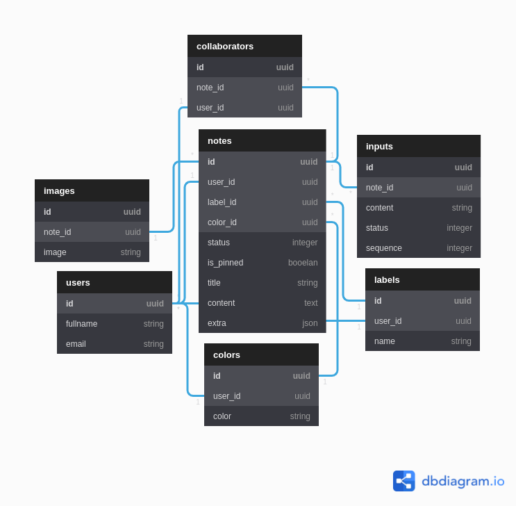

[](https://www.codacy.com/gh/nejdetkadir/google-keep-api/dashboard?utm_source=github.com&amp;utm_medium=referral&amp;utm_content=nejdetkadir/google-keep-api&amp;utm_campaign=Badge_Grade)

# Google Keep API

[Google Keep API](https://google-keep-api-app.herokuapp.com) with Ruby on Rails

## Database Schema


## API Endpoints
### Authentication
| Route | HTTP Verb | Request Body | Header Body | Description |
| --- | --- | --- | --- | --- |
| /users | `POST` | ```{user: {email: "foo@bar.com", password: "mypass", password_confirmation: "mypass", fullname: "şevo"}}``` | Empty | Returns authentication bearer token on header |
| /users/sign_in | `POST` | ```{user: {email: "foo@bar.com", password: "mypass"}}``` | Empty | Returns authentication bearer token on header |
| /users/sign_out | `DELETE` | Empty  | Authentication: Bearer Token | Returns sign out message |

### Colors
| Route | HTTP Verb | Request Body | Header Body | Description |
| --- | --- | --- | --- | --- |
| /colors | `GET` | Empty | Authentication: Bearer Token | Returns user's colors |
| /colors | `POST` | ```{color: {color: "hexcode-or-rgb-or-etc"}}``` | Authentication: Bearer Token | Returns created resource or error messages |
| /colors/:id | `GET` | Empty  | Authentication: Bearer Token | Returns resource |
| /colors/:id | `PATCH` | ```{color: {color: "#fff"}}```  | Authentication: Bearer Token | Returns updated resource or error messages |
| /colors/:id | `PUT` | ```{color: {color: "#fff"}}``` | Authentication: Bearer Token | Returns updated resource or error messages |
| /colors/:id | `DELETE` | Empty  | Authentication: Bearer Token | Returns status of destroying |

### Labels
| Route | HTTP Verb | Request Body | Header Body | Description |
| --- | --- | --- | --- | --- |
| /labels | `GET` | Empty | Authentication: Bearer Token | Returns user's labels |
| /labels | `POST` | ```{label: {name: "Business"}}``` | Authentication: Bearer Token | Returns created resource or error messages |
| /labels/:id | `GET` | Empty  | Authentication: Bearer Token | Returns resource |
| /labels/:id | `PATCH` | ```{label: {name: "Birthday"}}```  | Authentication: Bearer Token | Returns updated resource or error messages |
| /labels/:id | `PUT` | ```{label: {name: "Car"}}``` | Authentication: Bearer Token | Returns updated resource or error messages |
| /labels/:id | `DELETE` | Empty  | Authentication: Bearer Token | Returns status of destroying |

### Notes
| Route | HTTP Verb | Request Body | Header Body | Description |
| --- | --- | --- | --- | --- |
| /notes | `GET` | Empty | Authentication: Bearer Token | Returns user's notes |
| /notes?status=normal | `GET` | Empty | Authentication: Bearer Token | Returns user's normal notes |
| /notes?status=archived | `GET` | Empty | Authentication: Bearer Token | Returns user's archived notes |
| /notes?status=deleted | `GET` | Empty | Authentication: Bearer Token | Returns user's deleted notes |
| /notes | `POST` | ```{label: {name: "Business"}}``` | Authentication: Bearer Token | Returns created resource or error messages |
| /notes/:id | `GET` | Empty  | Authentication: Bearer Token | Returns resource |
| /notes/:id | `PATCH` | ```{label: {name: "Birthday"}}```  | Authentication: Bearer Token | Returns updated resource or error messages |
| /notes/:id | `PUT` | ```{label: {name: "Car"}}``` | Authentication: Bearer Token | Returns updated resource or error messages |
| /notes/:id | `DELETE` | Empty  | Authentication: Bearer Token | Returns status of destroying |

### Images of Note
| Route | HTTP Verb | Request Body | Header Body | Description |
| --- | --- | --- | --- | --- |
| /notes/:note_id/images | `GET` | Empty | Authentication: Bearer Token | Returns user's images of note |
| /notes/:note_id/images | `POST` | ```{image: {image: Image File}}``` | Authentication: Bearer Token | Returns created resource or error messages |
| /notes/:note_id/images/:id | `DELETE` | Empty  | Authentication: Bearer Token | Returns status of destroying |

### Todos of Note
| Route | HTTP Verb | Request Body | Header Body | Description |
| --- | --- | --- | --- | --- |
| /notes/:note_id/todos | `GET` | Empty | Authentication: Bearer Token | Returns user's todos of note |
| /notes/:note_id/todos | `POST` | ```{todo: {content: "Create a CV", status: 0, sequence: 0}}``` | Authentication: Bearer Token | Returns created resource or error messages |
| /notes/:note_id/todos/:id | `GET` | Empty | Authentication: Bearer Token | Returns resource |
| /notes/:note_id/todos/:id | `PATCH` | ```{todo: {sequence: 1}}``` | Authentication: Bearer Token | Returns updated resource or error messages |
| /notes/:note_id/todos/:id | `PUT` | ```{todo: {sequence: 2}}``` | Authentication: Bearer Token | Returns updated resource or error messages |
| /notes/:note_id/todos/:id | `DELETE` | Empty  | Authentication: Bearer Token | Returns status of destroying |

### Collaborators of Note
| Route | HTTP Verb | Request Body | Header Body | Description |
| --- | --- | --- | --- | --- |
| /notes/:note_id/collaborators | `GET` | Empty | Authentication: Bearer Token | Returns user's collaborators of note |
| /notes/:note_id/collaborators | `POST` | ```{collaborator: {email: "foo@bar.com"}}``` | Authentication: Bearer Token | Returns created resource or error messages |
| /notes/:note_id/collaborators/:id | `DELETE` | Empty  | Authentication: Bearer Token | Returns status of destroying |

# Installation
## Prerequisites
- [Ruby](https://rvm.io/)
- [NodeJS (>=10.x)](https://nodejs.org/en/download/package-manager/#debian-and-ubuntu-based-linux-distributions)
- [PostgreSQL](https://www.postgresql.org/download/)
- [ImageMagick](https://imagemagick.org/) `sudo apt-get install imagemagick libmagickcore-dev libmagickwand-dev`

## Installation
- Install GEM dependencies:

  ```bash
  bundle install
  ```

- Create database, migrate tables and run the seed data:

  ```bash
  rails db:create
  rails db:migrate
  rails db:seed
  ```

- If you are setting up again, when you already have previous databases:

  ```bash
  rails db:reset
  ```
- For dropping database
  ```bash
  rails db:drop
  ``` 

# LICENSE
```
GNU GENERAL PUBLIC LICENSE Version 3
```