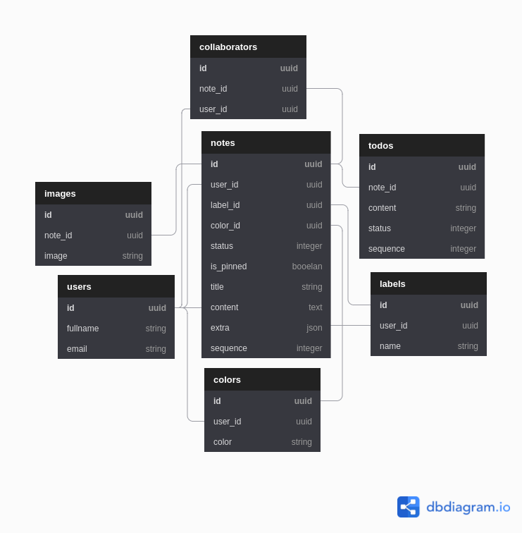

[](https://www.codacy.com/gh/nejdetkadir/google-keep-api/dashboard?utm_source=github.com&amp;utm_medium=referral&amp;utm_content=nejdetkadir/google-keep-api&amp;utm_campaign=Badge_Grade)

# Google Keep API

Google Keep API with Ruby on Rails

## Database Schema


# Installation
## Prerequisites
- [Ruby](https://rvm.io/)
- [NodeJS (>=10.x)](https://nodejs.org/en/download/package-manager/#debian-and-ubuntu-based-linux-distributions)
- [PostgreSQL](https://www.postgresql.org/download/)
- [ImageMagick](https://imagemagick.org/) `sudo apt-get install imagemagick libmagickcore-dev libmagickwand-dev`

## Installation
- Install GEM dependencies:

  ```bash
  bundle install
  ```

- Create database, migrate tables and run the seed data:

  ```bash
  rails db:create
  rails db:migrate
  rails db:seed
  ```

- If you are setting up again, when you already have previous databases:

  ```bash
  rails db:reset
  ```
- For dropping database
  ```bash
  rails db:drop
  ``` 

# LICENSE
```
GNU GENERAL PUBLIC LICENSE Version 3
```